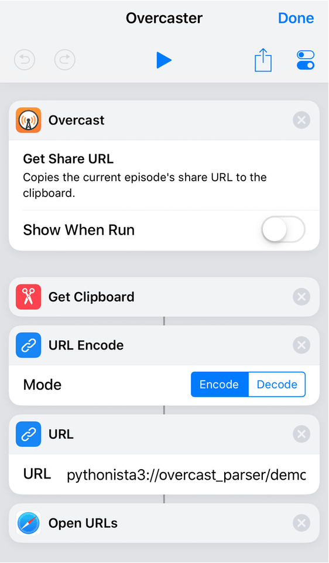

# Overcast URL to podcast information
[](https://pypi.org/project/overcast-parser/)
[](https://github.com/hbmartin/overcast_parser/issues)
[](https://github.com/ambv/black)
[](https://travis-ci.com/hbmartin/overcast_parser)

Python library to obtain RSS feed URL from Overcast link, built especially for Pythonista

## Installation / Upgrade

This can be installed one of two ways:

First, it can be installed directly in Pythonista with [StaSh](https://github.com/ywangd/stash)

```
pip install overcast-parser
```

Alternately, you can copy this entire repo to Pythonista and start immediately editing demo.py. This can be done i.e. with a git tool in Pythonista or, on your Mac, copying this to the Pythonista3 iCloud directory.


## Usage

#### See demo.py for full pythonista script

```
from overcast_parser.OvercastParser import OvercastParser


parser = OvercastParser()

data = requests.get(overcast_url).text

(itunes_id, stream_url, overcast_id, title) = parser.parse_overcast(data)
```

## Shortcut
demo.py is meant to be used from either the share extension or from an iOS Shortcut. (Note that due to Pythonista limitations share extension cannot call a script in iCloud.)

You can [download a shortcut here](https://www.icloud.com/shortcuts/942bc3f2f69747429960fefdde4ccb2c) or create one like:

Where the final URL block is like (adjusted for your path or removing root=icloud)
```
pythonista3://overcast_parser/demo.py?action=run&root=icloud&args=URL Encoded Text
```

## Built With

* [pythonista-stubs](https://github.com/hbmartin/pythonista-stubs) - for desktop development
* [itunes_podcast_rss](https://github.com/wotaen/itunes_podcast_rss) - obtain RSS feed URL from iTunes link (built-in)
* [podcastparser](https://github.com/gpodder/podcastparser) - for parsing podcast feed (dependency)

## Contributing

Pull requests are welcome. For major changes, please open an issue first to discuss what you would like to change.

### Planned improvements
* Better error catching, more error throwing

### Code Formatting

This project is linted with [pyflakes](https://github.com/PyCQA/pyflakes) and makes strict use of [Black](https://github.com/ambv/black) for code formatting.

## Authors

* [Harold Martin](https://www.linkedin.com/in/harold-martin-98526971/) - harold.martin at gmail


## License

[MIT](LICENSE.txt)